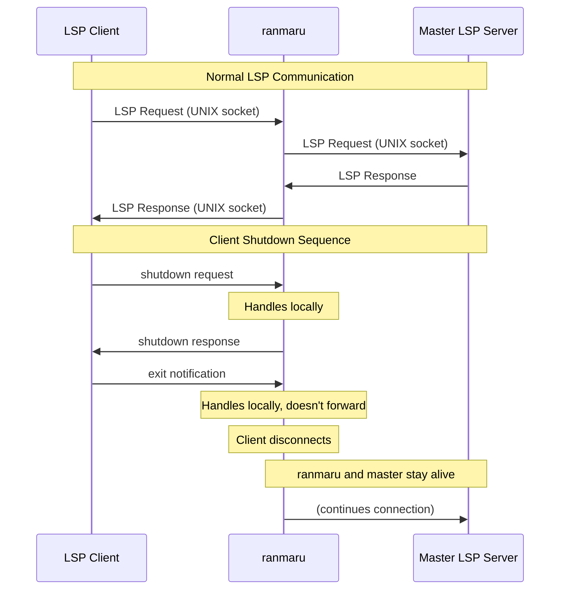

# ranmaru: An LSP Proxy to Keep the Master Alive

[](https://akirak.cachix.org)


<!-- The above image is in the public domain. See https://en.wikipedia.org/wiki/Mori_Ranmaru#/media/File:Mori_Ranmaru-Utagawa_Kuniyoshi-ca.1850-_from_TAIHEIKI_EIYUDEN.jpg -->

*Ranmaru* (RAHN-mah-roo, 蘭丸) is an LSP proxy that allows multiple clients
to connect to a single long-running LSP server instance while handling
shutdown and exit requests gracefully.

Why is this important? Typical language server SDKs such as
[vscode-languageserver](https://github.com/Microsoft/vscode-languageserver-node)
(for Node.js) assume one client per server. When a client disconnects from its
peer, it sends an exit notification to the server, causing the entire
server program to exit. The server SDK also has a built-in watchdog mechanism
that forces the server to exit after the client process ends. This becomes a
limitation when you want to develop a program that serves as an LSP server but also
provides other services such as the Model Context Protocol (MCP), because LSP
client disconnection terminates the entire program.

With *ranmaru*, this will no longer be the case. You can develop
a long-running multi-role server that accepts connections from multiple clients
using any of the standard SDKs for developing language servers.

> [!NOTE]
> In Japanese history, *Mori Ranmaru* (森蘭丸) was a retainer to *Oda Nobunaga*
> (織田信長). He was a loyal servant to his master, and they died on the same day
> when they were surrounded by rebels, without allowing the rebels to find their
> bodies.

## How it works

> [!IMPORTANT]
> Ranmaru currently supports UNIX domain sockets as the only transport protocol.
> The master language server must support UNIX domain sockets, which is not
> common at present. It would be possible for ranmaru to support other
> transports such as TCP sockets and stdio, but this would be less suitable for
> the intended use cases.

*Ranmaru* acts as a gateway that accepts multiple client connections over UNIX
domain sockets and forwards them to a master LSP server. It handles shutdown
requests and exit notifications locally without forwarding them to the master
server, ensuring the master server stays alive. It also survives client
disconnections and manages JSON-RPC message ID translation to avoid conflicts
between multiple clients.



## Prerequisites

*Ranmaru* is written in OCaml 5 and packaged with Nix.
It should run on UNIX-like systems (e.g., Linux and macOS).

You can use Nix to run the program:

``` shell
nix run github:akirak/ranmaru
```

> [!WARNING]
> The Nix package currently fails to build on macOS.

If you're not using Nix, use Dune to build the program from source.

## Usage

Accept connections from multiple clients and forward to a master server:

``` shell
ranmaru --client CLIENT --master SERVER
```

### Command Line Options

- `--client CLIENT` - Path to the UNIX domain socket that ranmaru listens on. It should not exist.
- `--master SERVER` - Path to the UNIX domain socket of the master LSP server. It must exist before ranmaru starts.

### Environment Variables

You can also configure ranmaru using environment variables:

- `RANMARU_CLIENT_SOCKET` - UNIX socket path to listen to (equivalent to `--client`)
- `RANMARU_MASTER_SOCKET` - UNIX socket path of the upstream server (equivalent to `--master`)

Command line options take precedence over environment variables.

### Examples

Using command line options:
``` shell
ranmaru --client /tmp/ranmaru-client.sock --master /tmp/master-lsp.sock
```

Using environment variables:
``` shell
export RANMARU_CLIENT_SOCKET=/tmp/ranmaru-client.sock
export RANMARU_MASTER_SOCKET=/tmp/master-lsp.sock
ranmaru
```

## Configuration examples for LSP clients

### Emacs Eglot

Eglot can connect to ranmaru via UNIX domain sockets. This configuration creates
a reusable connection that survives across eglot connection shutdowns and/or
Emacs restarts:

``` emacs-lisp
(defcustom my/ranmaru-socket-path "/tmp/ranmaru-client.sock"
  "Path to the UNIX socket that ranmaru listens on for client connections."
  :type 'string
  :group 'eglot)

(defvar my/ranmaru-socket-process nil
  "The current socket process connection to ranmaru.")

(defun my/ranmaru-eglot-contact (_interactive _project)
  "Create or reuse a UNIX socket connection to ranmaru for Eglot.
This function maintains a persistent connection that can be shared
across multiple Eglot sessions."
  (unless (and my/ranmaru-socket-process
               (process-live-p my/ranmaru-socket-process))
    (setq my/ranmaru-socket-process
          (make-network-process :name "ranmaru-eglot"
                                :buffer nil
                                :family 'local
                                :service my/ranmaru-socket-path
                                :nowait t)))
  (list 'eglot-lsp-server :process my/ranmaru-socket-process))

;; Example configuration for a specific mode
(add-to-list 'eglot-server-programs '(python-mode . my/ranmaru-eglot-contact))
```

Here are steps:

1. Start your master LSP server with UNIX socket support (e.g., on
   `/tmp/master-lsp.sock`)
2. Start ranmaru: `ranmaru /tmp/ranmaru-client.sock /tmp/master-lsp.sock`
3. Configure Eglot as shown above
4. Use `M-x eglot` normally in your source files
